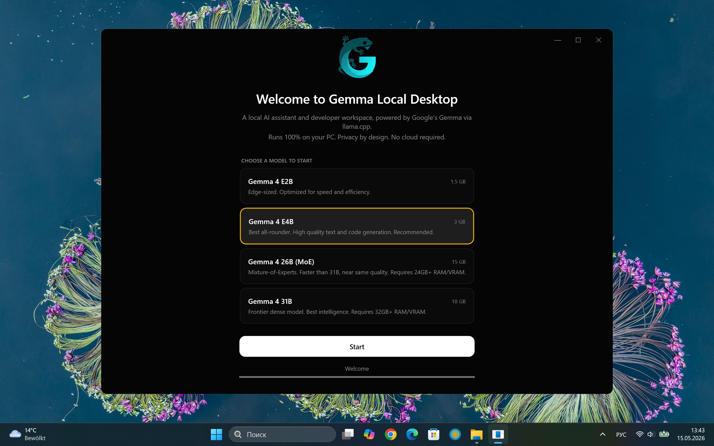
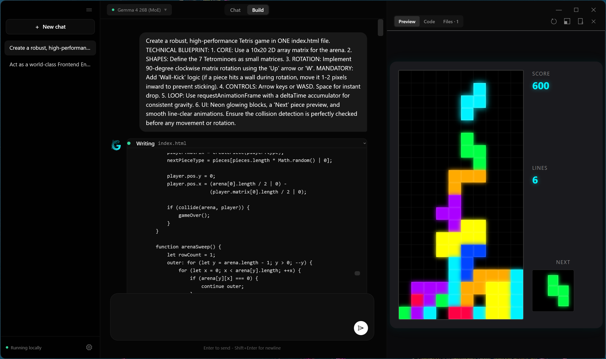
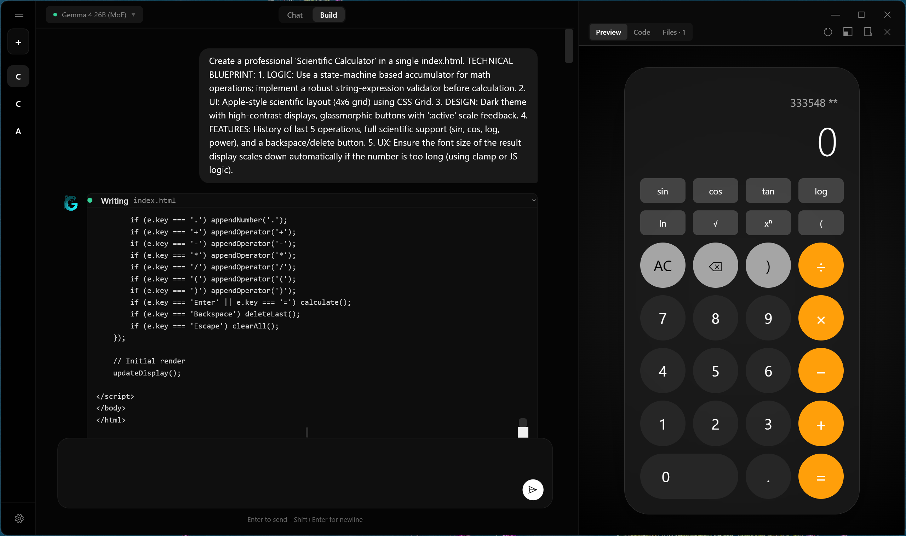

# Gemma Local Desktop

<p align="center">
  
</p>

<h1 align="center">Gemma Local Desktop</h1>

<p align="center">
  <strong>Native Windows AI assistant and coding workspace.</strong><br/>
  Powered by Google's Gemma via llama.cpp.<br/>
  No API keys. No cloud. Works 100% offline.
</p>

---

## 🚀 Experimental Project Status

This is an **experimental project** designed to push the boundaries of local AI development on Windows. Despite its experimental nature, the application is **fully functional** and provides a stable environment for local LLM interaction.

### Model Performance Notes:
- **Small Models (E2B / E4B)**: Great for quick tests and low-latency interactions. While capable, they have natural limitations due to their parameter count—operate within reasonable expectations.
- **Large Models (26B / 31B)**: These models handle complex coding tasks, logic, and creative requests **perfectly**, as originally intended. They provide a good level of performance on consumer hardware.

---

## 📸 Screenshots

<p align="center">
  
  
  
</p>

---

## Key Features

- 💬 **Chat Mode** — Optimized for pure dialogue and reasoning.
- 🛠 **Build Mode** — Specialized workspace for generating code, web apps, and artifacts with a 720px live preview.
- 🚀 **One-Click Templates** — Instant high-fidelity starters like *Mega Tetris* and *Dynamic Weather Dashboard*.
- 🖥 **Full-Screen Preview** — One button to view your creation in your default system browser.
- 📂 **Workspace Persistence** — Per-chat projects saved on disk. The model can read and edit existing files iteratively.
- 🎨 **Modern UX** — Clean Windows design with glassmorphism, resizable canvas, and dark mode.
- 🎮 **GPU Acceleration** — Intelligent NVIDIA GPU detection with partial offloading for large models (MoE 26B).
- 📦 **Zero Config** — Fully automated environment setup: downloads runtimes and models on first start.

## Requirements

- **Windows 10/11** (64-bit)
- **NVIDIA GPU** (optional, for CUDA acceleration) or CPU
- **4GB+ RAM** for Gemma 2B model

## Quick Start

1. Clone the repository.
2. Ensure you have the [.NET 10 SDK](https://dotnet.microsoft.com/download/dotnet/10.0) installed.
3. Run the application:
   ```powershell
   cd GemmaChatCsharp
   dotnet run
   ```
   ```

On first launch, the app will:
1. Detect your hardware (CPU vs NVIDIA GPU).
2. Download the appropriate `llama.cpp` server binaries.
3. Download the recommended Gemma model (~1.6GB).
4. Initialize your local workspace.

## Build & Publish

If you want to create a standalone executable:

### Standard Build
```powershell
dotnet build -c Release
```

### Create Single EXE (Portable)
To generate a single `.exe` file that includes everything (self-contained):
```powershell
dotnet publish -c Release -r win-x64 --self-contained true -p:PublishSingleFile=true -p:IncludeNativeLibrariesForSelfExtract=true
```
The output will be in `bin/Release/net10.0-windows/win-x64/publish/`.

## Tech Stack

| Layer | Tech |
|-------|------|
| App Shell | WPF (.NET 10) + CommunityToolkit.Mvvm |
| WebView | Microsoft.Web.WebView2 |
| Markdown | Markdig.Wpf |
| Model Runtime | [llama.cpp](https://github.com/ggml-org/llama.cpp) (local server) |
| persistence | Local JSON state + Workspace filesystem |

## Shortcuts

- `Ctrl + N`: New chat
- `Ctrl + B`: Toggle Chat/Build mode
- `Ctrl + \`: Toggle Canvas (Preview/Code)

## License

MIT